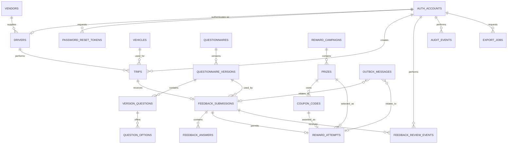
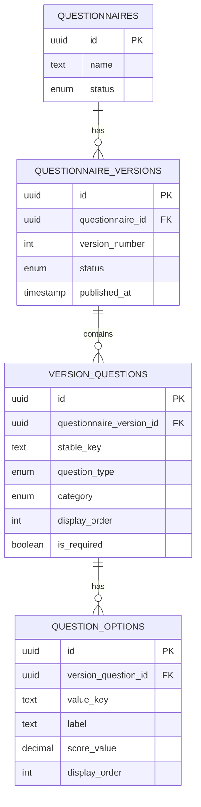
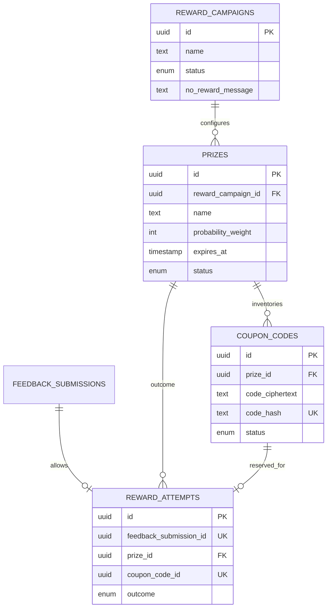

# Driver Feedback Service — Logical Data Model

**Status:** Initial logical design  
**Derived from:** [PRODUCT.md](PRODUCT.md)  
**Last updated:** 2026-07-20  
**Scope:** Backend persistence, integrity rules, offline synchronization boundary, analytics, rewards, and auditability

## 1. Purpose

This document translates the product requirements into a logical relational data model. It is the reference for database migrations, ORM models, repository interfaces, API resources, fixtures, and backend-to-frontend contracts.

It deliberately stops short of framework-specific migration code. The final database and backend stack have not yet been selected. PostgreSQL is the recommended database because the model benefits from transactions, row locking, partial indexes, strong constraints, JSON support, and reliable analytical queries.

## 2. Modeling principles

1. **The database protects core business invariants.** One response per trip, one reward attempt per response, and one award per coupon must be unique constraints rather than frontend conventions.
2. **Historical facts do not change when master data changes.** Trips and responses keep snapshots of driver source, vendor, vehicle, questionnaire, and reward details where reporting or customer communication depends on them.
3. **Submitted feedback is append-only.** Answers are never updated. Administrative flag/archive actions are separate events.
4. **Questionnaires are versioned.** Administrators edit drafts and publish immutable versions. Every response points to a published version and stores a complete immutable snapshot.
5. **Offline retries are idempotent.** A client-generated submission ID is created before the first network attempt and has a server-enforced uniqueness constraint.
6. **Rewards are server-authoritative.** Prize selection and coupon reservation occur online inside one database transaction.
7. **Personal data is explicit.** Passenger contact data is isolated to feedback records, excluded from driver-facing reads, and encrypted at the application layer where appropriate.
8. **Aggregates are derived.** Driver scores are calculated from immutable answers and are not manually editable.
9. **Archive instead of delete.** Records referenced by history remain available for audit and reporting.
10. **Time is unambiguous.** Persist timestamps in UTC and render them in the agency timezone, initially `Asia/Kolkata`.

## 3. Identifier and column conventions

### 3.1 Identifiers

- Use UUID primary keys for domain records.
- UUIDv7 is recommended for locality and time ordering if supported by the selected stack; otherwise use UUIDv4.
- Public API identifiers use the same UUID unless later security requirements introduce separate public IDs.
- Human-readable identifiers such as driver IDs and booking references remain separate business keys.

### 3.2 Timestamps

Most mutable tables include:

- `created_at`: creation timestamp
- `updated_at`: last permitted modification timestamp
- `archived_at`: nullable archive timestamp

Immutable event tables generally use only `created_at` or a more specific event timestamp.

All timestamps are timezone-aware. PostgreSQL implementations should use `timestamptz`.

### 3.3 Actor references

Administrative changes use `created_by_account_id`, `updated_by_account_id`, or immutable audit events where appropriate. A null actor is allowed only for clearly defined system actions.

### 3.4 Money and locale

The current product does not assign monetary values to prizes. If prize value is added later, store currency as an ISO 4217 code and money as an integer minor-unit amount; never use floating point.

## 4. Domain overview



## 5. Authentication and people

### 5.1 `auth_accounts`

Represents a person who can authenticate. Passengers are not accounts.

| Column | Logical type | Null | Notes |
| --- | --- | --- | --- |
| `id` | UUID | No | Primary key |
| `role` | enum | No | `ADMIN` or `DRIVER` |
| `display_name` | text | No | Name shown in authenticated UI and audit logs |
| `email` | normalized text | No | Required for reset links; unique case-insensitively |
| `password_hash` | text | No | Adaptive password hash only |
| `status` | enum | No | `ACTIVE`, `DEACTIVATED`, or `ARCHIVED` |
| `password_changed_at` | timestamp | No | Invalidates older sessions/reset links as defined by auth policy |
| `last_login_at` | timestamp | Yes | Operational metadata |
| `created_at` | timestamp | No | |
| `updated_at` | timestamp | No | |
| `archived_at` | timestamp | Yes | Present when archived |

Constraints:

- Case-insensitive unique index on normalized `email`.
- `archived_at` is present exactly when `status = ARCHIVED`.
- Only `ACTIVE` accounts may start authenticated sessions.
- Role cannot change after the account has domain history; create a new account instead.

### 5.2 `drivers`

Stores driver-specific profile and employment/source information.

| Column | Logical type | Null | Notes |
| --- | --- | --- | --- |
| `id` | UUID | No | Primary key |
| `account_id` | UUID | No | Unique foreign key to `auth_accounts` with role `DRIVER` |
| `driver_code` | text | No | Human-entered sign-in ID; normalized and unique |
| `phone` | text | Yes | Operational contact, not passenger data |
| `source_type` | enum | No | `AGENCY` or `OUTSOURCED` |
| `vendor_id` | UUID | Yes | Required only for outsourced drivers |
| `created_at` | timestamp | No | |
| `updated_at` | timestamp | No | |

Constraints:

- Unique normalized `driver_code`.
- `source_type = OUTSOURCED` requires `vendor_id`.
- `source_type = AGENCY` requires `vendor_id` to be null.
- The referenced account must have role `DRIVER`; enforce in the service or with a database trigger if the database cannot express the cross-table check.

Changing a driver's source or vendor affects future trips only. Existing trips retain source/vendor snapshots.

### 5.3 `password_reset_tokens`

Stores single-use password-reset challenges.

| Column | Logical type | Null | Notes |
| --- | --- | --- | --- |
| `id` | UUID | No | Primary key |
| `account_id` | UUID | No | Target account |
| `token_hash` | text | No | Unique hash; never store the raw token |
| `requested_by_account_id` | UUID | Yes | Null for self-service; admin ID when admin initiated |
| `expires_at` | timestamp | No | Time-limited |
| `used_at` | timestamp | Yes | Single-use marker |
| `created_at` | timestamp | No | |

The raw token exists only in the reset link delivered to the user.

### 5.4 `agency_settings`

A singleton configuration record for this single-agency product.

| Column | Logical type | Null | Notes |
| --- | --- | --- | --- |
| `id` | UUID | No | Primary key; one active row |
| `agency_name` | text | No | Initial value: Eastern Risen Expedition Pvt. Ltd. |
| `timezone` | text | No | Initial value: `Asia/Kolkata` |
| `default_thank_you_message` | text | No | Used when rewards are disabled/unavailable |
| `active_consent_version_id` | UUID | Yes | Required before passenger collection is launched |
| `created_at` | timestamp | No | |
| `updated_at` | timestamp | No | |

Brand assets and presentation tokens belong primarily to frontend configuration and may be added later.

### 5.5 `consent_versions`

Preserves the exact privacy/consent statement accepted by a passenger.

| Column | Logical type | Null | Notes |
| --- | --- | --- | --- |
| `id` | UUID | No | Primary key |
| `version` | integer | No | Monotonically increasing |
| `content` | text | No | Immutable once activated |
| `effective_at` | timestamp | No | |
| `retired_at` | timestamp | Yes | |
| `created_by_account_id` | UUID | No | Admin author |
| `created_at` | timestamp | No | |

## 6. Operational master data

### 6.1 `vendors`

Represents companies that supply outsourced drivers.

| Column | Logical type | Null | Notes |
| --- | --- | --- | --- |
| `id` | UUID | No | Primary key |
| `name` | text | No | Unique among non-archived vendors |
| `contact_name` | text | Yes | Optional operational contact |
| `contact_email` | text | Yes | |
| `contact_phone` | text | Yes | |
| `status` | enum | No | `ACTIVE`, `DEACTIVATED`, `ARCHIVED` |
| `created_at` | timestamp | No | |
| `updated_at` | timestamp | No | |
| `archived_at` | timestamp | Yes | |

Archiving a vendor does not null historical driver or trip references.

### 6.2 `vehicles`

Normalizes reusable vehicle information while allowing each trip to keep a snapshot.

| Column | Logical type | Null | Notes |
| --- | --- | --- | --- |
| `id` | UUID | No | Primary key |
| `registration_number` | text | No | Normalized unique vehicle reference |
| `display_name` | text | No | Model, fleet label, or friendly name |
| `status` | enum | No | `ACTIVE`, `DEACTIVATED`, `ARCHIVED` |
| `created_at` | timestamp | No | |
| `updated_at` | timestamp | No | |
| `archived_at` | timestamp | Yes | |

The initial product needs only basic vehicle identity. Additional fleet-management fields are out of scope.

## 7. Trips

### 7.1 `trips`

Represents a completed or expected journey for which one response may be collected.

| Column | Logical type | Null | Notes |
| --- | --- | --- | --- |
| `id` | UUID | No | Primary key |
| `booking_reference` | text | No | Agency business reference; indexed |
| `passenger_name` | text | No | Operational passenger name entered before handoff |
| `pickup_location` | text | No | |
| `destination` | text | No | |
| `scheduled_at` | timestamp | No | Trip date/time |
| `vehicle_id` | UUID | Yes | Nullable if free-text vehicle capture must be supported |
| `vehicle_snapshot` | JSON object | No | Registration/display details as known for this trip |
| `driver_id` | UUID | No | Assigned driver |
| `driver_name_snapshot` | text | No | Historical display value |
| `driver_code_snapshot` | text | No | Historical business identifier |
| `driver_source_snapshot` | enum | No | `AGENCY` or `OUTSOURCED` |
| `vendor_id` | UUID | Yes | Historical reference where available |
| `vendor_name_snapshot` | text | Yes | Required for outsourced driver snapshot |
| `creation_source` | enum | No | `ADMIN_ASSIGNED` or `DRIVER_ENTERED` |
| `created_by_account_id` | UUID | No | Admin or assigned driver |
| `status` | enum | No | See lifecycle below |
| `started_feedback_at` | timestamp | Yes | First transition into passenger mode |
| `created_at` | timestamp | No | |
| `updated_at` | timestamp | No | |
| `archived_at` | timestamp | Yes | |

Recommended trip lifecycle:

```mermaid
stateDiagram-v2
    [*] --> READY: created and assigned
    READY --> FEEDBACK_STARTED: driver starts handoff
    FEEDBACK_STARTED --> SUBMITTED: online response accepted
    FEEDBACK_STARTED --> SYNC_PENDING: response queued on device
    SYNC_PENDING --> SUBMITTED: server accepts retry
    READY --> ARCHIVED: admin archives
    FEEDBACK_STARTED --> ARCHIVED: admin archives without response
    SUBMITTED --> ARCHIVED: trip archived; response retained
```



`SYNC_PENDING` is primarily a client state. The server may not know a response is waiting offline. The canonical server-side trip can remain `FEEDBACK_STARTED` until synchronization; API responses may compute a device-local overlay for `SYNC_PENDING`.

Constraints:

- The authenticated driver may create a `DRIVER_ENTERED` trip only with their own `driver_id`.
- `driver_source_snapshot = OUTSOURCED` requires `vendor_name_snapshot`.
- `creation_source = DRIVER_ENTERED` requires `created_by_account_id` to be the assigned driver's account.
- Booking references are indexed but not globally unique unless the agency confirms that rule.
- A unique constraint on `feedback_submissions.trip_id` enforces at most one response per trip.

## 8. Questionnaire versioning

### 8.1 Version strategy

`questionnaires` is the stable logical questionnaire. `questionnaire_versions` contains editable drafts and immutable published versions. Questions and options belong to a specific version.

Publishing follows this rule:

1. Validate the draft.
2. Retire the previously active version, if any.
3. Mark the draft version active.
4. Perform steps 2–3 in one transaction with a constraint allowing only one active version.
5. Never edit active or retired versions. Clone to a new draft for future changes.



### 8.2 `questionnaires`

| Column | Logical type | Null | Notes |
| --- | --- | --- | --- |
| `id` | UUID | No | Primary key |
| `name` | text | No | Admin-facing name |
| `status` | enum | No | `ACTIVE` or `ARCHIVED` |
| `created_by_account_id` | UUID | No | |
| `created_at` | timestamp | No | |
| `updated_at` | timestamp | No | |
| `archived_at` | timestamp | Yes | |

The initial system may contain one questionnaire, but the model permits archived logical questionnaires without introducing multi-tenancy.

### 8.3 `questionnaire_versions`

| Column | Logical type | Null | Notes |
| --- | --- | --- | --- |
| `id` | UUID | No | Primary key |
| `questionnaire_id` | UUID | No | Parent logical questionnaire |
| `version_number` | integer | No | Unique per questionnaire |
| `status` | enum | No | `DRAFT`, `ACTIVE`, `RETIRED`, `ARCHIVED` |
| `published_at` | timestamp | Yes | Required for active/retired versions |
| `retired_at` | timestamp | Yes | |
| `created_by_account_id` | UUID | No | |
| `created_at` | timestamp | No | |
| `updated_at` | timestamp | No | Draft modification time |

Constraints:

- Unique `(questionnaire_id, version_number)`.
- Only one globally active version in the initial product.
- Published versions cannot be updated or deleted.

### 8.4 `version_questions`

| Column | Logical type | Null | Notes |
| --- | --- | --- | --- |
| `id` | UUID | No | Primary key |
| `questionnaire_version_id` | UUID | No | Parent version |
| `stable_key` | text | No | Stable semantic key within a questionnaire lineage |
| `prompt` | text | No | Passenger-visible wording |
| `question_type` | enum | No | See values below |
| `category` | enum/text | No | Reporting category |
| `is_required` | boolean | No | |
| `display_order` | integer | No | Zero- or one-based consistently in implementation |
| `contributes_to_score` | boolean | No | Controls aggregate inclusion |
| `score_min` | decimal | Yes | Numeric lower bound where applicable |
| `score_max` | decimal | Yes | Numeric upper bound where applicable |

Question types:

- `STAR_RATING`
- `EMOJI_RATING`
- `YES_NO`
- `SINGLE_CHOICE`
- `MULTIPLE_CHOICE`
- `TEXT`

Initial reporting categories:

- `OVERALL_EXPERIENCE`
- `DRIVING_SAFETY`
- `PUNCTUALITY`
- `CLEANLINESS`
- `PROFESSIONALISM`
- `VEHICLE_CONDITION`
- `CUSTOM`

Constraints:

- Unique `(questionnaire_version_id, display_order)`.
- Unique `(questionnaire_version_id, stable_key)`.
- Rating questions that contribute to scores require score bounds or scored options.
- Text questions do not contribute to scores.

### 8.5 `question_options`

Used for emoji, yes/no, single-choice, and multiple-choice questions.

| Column | Logical type | Null | Notes |
| --- | --- | --- | --- |
| `id` | UUID | No | Primary key |
| `version_question_id` | UUID | No | Parent question |
| `value_key` | text | No | Stable machine value within this question |
| `label` | text | No | Passenger-visible label |
| `score_value` | decimal | Yes | Optional normalized score for analytics |
| `display_order` | integer | No | |

Constraints:

- Unique `(version_question_id, value_key)`.
- Unique `(version_question_id, display_order)`.
- Options on a published questionnaire version are immutable.

## 9. Feedback and answers

### 9.1 `feedback_submissions`

Stores one immutable passenger submission per trip.

| Column | Logical type | Null | Notes |
| --- | --- | --- | --- |
| `id` | UUID | No | Server primary key |
| `client_submission_id` | UUID | No | Generated before first network attempt; globally unique |
| `trip_id` | UUID | No | Unique foreign key |
| `driver_id` | UUID | No | Historical relation for efficient filtering |
| `driver_name_snapshot` | text | No | |
| `driver_source_snapshot` | enum | No | `AGENCY` or `OUTSOURCED` |
| `vendor_id` | UUID | Yes | Historical relation where available |
| `vendor_name_snapshot` | text | Yes | Historical value |
| `booking_reference_snapshot` | text | No | From trip at handoff |
| `respondent_name` | text | No | Passenger-provided name |
| `respondent_phone_ciphertext` | encrypted text | No | Application-encrypted where supported |
| `respondent_phone_lookup_hash` | text | Yes | Optional keyed hash only if lookup is required |
| `respondent_email_ciphertext` | encrypted text | No | Needed for reward delivery |
| `respondent_email_lookup_hash` | text | Yes | Optional keyed hash for controlled lookup/deduplication |
| `respondent_booking_reference` | text | No | Passenger-provided reference |
| `consent_version_id` | UUID | No | Accepted consent text |
| `consented_at` | timestamp | No | |
| `questionnaire_version_id` | UUID | No | Published version used |
| `questionnaire_snapshot` | JSON object | No | Complete immutable rendering/validation snapshot |
| `submitted_at` | timestamp | No | Client-observed completion timestamp |
| `received_at` | timestamp | No | Server acceptance timestamp |
| `submission_mode` | enum | No | `ONLINE` or `OFFLINE_SYNC` |
| `current_review_state` | enum | No | `NORMAL`, `FLAGGED`, or `ARCHIVED` |
| `archived_at` | timestamp | Yes | Denormalized current state for filtering |
| `archived_by_account_id` | UUID | Yes | |
| `created_at` | timestamp | No | Same logical event as server persistence |

Constraints:

- Unique `client_submission_id` for idempotency.
- Unique `trip_id` for one response per trip.
- Questionnaire version must have been active/published at handoff or otherwise be accepted under an explicit stale-client policy.
- Feedback rows and their submitted fields are immutable after insertion; only review-state fields may change through a controlled service transaction that also creates a review event.
- `driver_id`, source, vendor, and booking reference must match the server-authorized trip snapshot, not blindly trust the client payload.

Why both a version reference and `questionnaire_snapshot` are stored:

- The version reference supports joins and configuration history.
- The snapshot guarantees the exact passenger-visible wording, order, required flags, options, and scoring configuration survive any future migration or accidental configuration change.

### 9.2 `feedback_answers`

Stores one answer per answered question.

| Column | Logical type | Null | Notes |
| --- | --- | --- | --- |
| `id` | UUID | No | Primary key |
| `feedback_submission_id` | UUID | No | Parent submission |
| `version_question_id` | UUID | No | Versioned question reference |
| `question_stable_key` | text | No | Snapshot semantic key |
| `question_prompt_snapshot` | text | No | Exact prompt |
| `question_type_snapshot` | enum | No | Exact type |
| `category_snapshot` | enum/text | No | Used for aggregate grouping |
| `display_order_snapshot` | integer | No | Exact order |
| `answer_payload` | JSON value | No | Canonical type-specific value and selected labels |
| `numeric_score` | decimal | Yes | Normalized score for analytics when applicable |
| `created_at` | timestamp | No | |

Constraints:

- Unique `(feedback_submission_id, version_question_id)`.
- Answer rows are insert-only.
- Required-question validation occurs before the parent submission transaction commits.
- `numeric_score` must be within the snapshotted bounds or one of the snapshotted option scores.
- `answer_payload` is validated against the question type by the service; PostgreSQL JSON Schema validation may be added but is not required for the logical model.

Recommended canonical answer payloads:

```json
{
  "star_rating": { "value": 5 },
  "emoji_rating": { "optionKey": "great", "label": "Great", "score": 5 },
  "yes_no": { "value": true, "label": "Yes" },
  "single_choice": { "optionKey": "clean", "label": "Clean" },
  "multiple_choice": {
    "options": [
      { "optionKey": "safe", "label": "Safe driving" },
      { "optionKey": "polite", "label": "Polite" }
    ]
  },
  "text": { "value": "Passenger comment" }
}
```

These are shape examples, not a single payload containing every type.

### 9.3 `feedback_review_events`

Provides an append-only record of administrative review actions.

| Column | Logical type | Null | Notes |
| --- | --- | --- | --- |
| `id` | UUID | No | Primary key |
| `feedback_submission_id` | UUID | No | Target |
| `action` | enum | No | `FLAG`, `UNFLAG`, `ARCHIVE`, optionally `RESTORE` after product approval |
| `reason` | text | Yes | Recommended for archive/restore |
| `performed_by_account_id` | UUID | No | Admin |
| `created_at` | timestamp | No | |

This table changes review state, never passenger answers.

## 10. Offline synchronization boundary

The unsynchronized queue belongs in frontend-controlled durable browser storage, normally IndexedDB. It is not a server table because the server cannot observe a device while it is offline.

The queued envelope must contain, at minimum:

| Field | Purpose |
| --- | --- |
| `clientSubmissionId` | Stable UUID reused for every retry |
| `tripId` | Server-issued trip identifier |
| `questionnaireVersionId` | Version loaded for the passenger |
| `questionnaireSnapshot` | Exact form shown and validation context |
| `respondent` | Passenger details and consent reference |
| `answers` | Ordered canonical answer payloads |
| `submittedAt` | Client completion timestamp |
| `retryMetadata` | Local attempt count and last non-sensitive error |

Synchronization contract:

1. The client creates `clientSubmissionId` before saving/submitting.
2. The client persists the complete envelope before declaring completion.
3. The server validates driver/trip ownership, questionnaire integrity, and required answers.
4. The server inserts the submission and answers in one transaction.
5. Repeating the same `clientSubmissionId` returns the original accepted result.
6. A different `clientSubmissionId` for an already-submitted `tripId` returns a deterministic duplicate-trip error and never creates a second response.
7. The client deletes the local payload only after a durable success acknowledgement.
8. Offline-synchronized responses do not receive a reward attempt.

The driver-facing frontend may keep non-sensitive queue metadata separate from the encrypted/minimized payload so it can show pending/failed counts without exposing passenger information.

## 11. Rewards and coupon inventory

### 11.1 Reward model



### 11.2 `reward_campaigns`

| Column | Logical type | Null | Notes |
| --- | --- | --- | --- |
| `id` | UUID | No | Primary key |
| `name` | text | No | Admin-facing name |
| `status` | enum | No | `DRAFT`, `ACTIVE`, `INACTIVE`, `ARCHIVED` |
| `no_reward_message` | text | No | Message for a no-prize result if supported |
| `starts_at` | timestamp | Yes | Optional schedule |
| `ends_at` | timestamp | Yes | Optional schedule |
| `created_by_account_id` | UUID | No | |
| `created_at` | timestamp | No | |
| `updated_at` | timestamp | No | |
| `archived_at` | timestamp | Yes | |

Only one campaign may be active at a time in the initial product.

### 11.3 `prizes`

| Column | Logical type | Null | Notes |
| --- | --- | --- | --- |
| `id` | UUID | No | Primary key |
| `reward_campaign_id` | UUID | No | Parent campaign |
| `name` | text | No | Passenger-visible prize name |
| `description` | text | Yes | Terms or usage detail |
| `probability_weight` | integer | No | Positive integer; final probability policy remains TBD |
| `inventory_limit` | integer | Yes | Optional cap; coupon count may impose a lower effective cap |
| `expires_at` | timestamp | No | Expired prizes are ineligible |
| `status` | enum | No | `ACTIVE`, `INACTIVE`, `ARCHIVED` |
| `created_at` | timestamp | No | |
| `updated_at` | timestamp | No | |
| `archived_at` | timestamp | Yes | |

Inventory shown to administrators is derived from eligible coupon codes and `inventory_limit`; do not rely on a freely editable “remaining” counter.

### 11.4 `coupon_codes`

| Column | Logical type | Null | Notes |
| --- | --- | --- | --- |
| `id` | UUID | No | Primary key |
| `prize_id` | UUID | No | Parent prize |
| `code_ciphertext` | encrypted text | No | Decrypted only for delivery/admin-authorized views |
| `code_lookup_hash` | text | No | Unique keyed hash to reject duplicate uploads |
| `status` | enum | No | `AVAILABLE`, `AWARDED`, `VOID`, `EXPIRED` |
| `expires_at` | timestamp | Yes | Optional per-code expiry; cannot exceed prize rules if configured |
| `awarded_at` | timestamp | Yes | |
| `created_at` | timestamp | No | |

There is no long-lived `RESERVED` state in the initial logical model because selection and award occur in one database transaction. If external fulfillment is introduced later, reservation expiry may be added.

### 11.5 `reward_attempts`

One row is the immutable result of one online wheel attempt.

| Column | Logical type | Null | Notes |
| --- | --- | --- | --- |
| `id` | UUID | No | Primary key |
| `feedback_submission_id` | UUID | No | Unique; one attempt per response |
| `reward_campaign_id` | UUID | No | Campaign snapshot reference |
| `outcome` | enum | No | `PRIZE` or `NO_PRIZE` if no-prize is enabled |
| `prize_id` | UUID | Yes | Required for `PRIZE` |
| `prize_name_snapshot` | text | Yes | Exact awarded name |
| `prize_expiry_snapshot` | timestamp | Yes | |
| `coupon_code_id` | UUID | Yes | Unique; required for coupon prize |
| `selected_at` | timestamp | No | |
| `email_delivery_status` | enum | No | `PENDING`, `SENT`, `FAILED`, `NOT_APPLICABLE` |
| `created_at` | timestamp | No | |

Constraints:

- Unique `feedback_submission_id`.
- Unique non-null `coupon_code_id`.
- Prize fields and coupon are required when `outcome = PRIZE`.
- A response with `submission_mode = OFFLINE_SYNC` cannot receive an attempt.

### 11.6 Atomic reward selection

The reward service must execute the following in one transaction:

1. Lock or otherwise serialize the feedback row's reward eligibility.
2. Reject if an attempt already exists.
3. Load the active campaign and eligible prizes.
4. Exclude inactive, expired, and out-of-stock prizes.
5. Select an outcome using the final configured probability rule.
6. Lock one available coupon for the chosen prize using a concurrency-safe strategy such as `FOR UPDATE SKIP LOCKED`.
7. Mark the coupon awarded.
8. Insert the immutable reward attempt.
9. Insert an outbox message for the reward email.
10. Commit before returning the outcome.

Email is sent after commit. An email failure retries delivery; it never reruns prize selection.

## 12. Messaging and background work

### 12.1 `outbox_messages`

Provides reliable asynchronous work without losing messages between the database commit and email/job processing.

| Column | Logical type | Null | Notes |
| --- | --- | --- | --- |
| `id` | UUID | No | Primary key |
| `message_type` | enum/text | No | For example `REWARD_EMAIL`, `PASSWORD_RESET_EMAIL`, `EXPORT_READY` |
| `aggregate_type` | text | No | Domain type |
| `aggregate_id` | UUID | No | Related domain record |
| `payload_ciphertext` | encrypted JSON | Yes | Sensitive delivery payload if needed |
| `status` | enum | No | `PENDING`, `PROCESSING`, `SENT`, `FAILED` |
| `attempt_count` | integer | No | Starts at zero |
| `next_attempt_at` | timestamp | No | Retry scheduling |
| `last_error_code` | text | Yes | Non-sensitive normalized error |
| `created_at` | timestamp | No | |
| `processed_at` | timestamp | Yes | |

Messages should use a uniqueness/idempotency key appropriate to the event, such as one reward email per reward attempt.

## 13. Exports and audit

### 13.1 `export_jobs`

| Column | Logical type | Null | Notes |
| --- | --- | --- | --- |
| `id` | UUID | No | Primary key |
| `requested_by_account_id` | UUID | No | Admin |
| `format` | enum | No | `CSV`, `XLSX`, `PDF` |
| `report_type` | text/enum | No | Defined by report catalog |
| `filter_snapshot` | JSON object | No | Exact requested filters |
| `included_field_snapshot` | JSON array | No | Proves which passenger fields were included |
| `status` | enum | No | `PENDING`, `PROCESSING`, `COMPLETED`, `FAILED`, `EXPIRED` |
| `storage_reference` | text | Yes | Private object reference, never a public permanent URL |
| `expires_at` | timestamp | Yes | Export file retention |
| `created_at` | timestamp | No | |
| `completed_at` | timestamp | Yes | |

Default field selection excludes passenger phone and email.

### 13.2 `audit_events`

Generic append-only administrative/security event log.

| Column | Logical type | Null | Notes |
| --- | --- | --- | --- |
| `id` | UUID | No | Primary key |
| `actor_account_id` | UUID | Yes | Null only for system actions |
| `action` | text/enum | No | Stable machine action |
| `entity_type` | text | No | |
| `entity_id` | UUID | Yes | |
| `metadata` | JSON object | No | Allowlisted, non-sensitive context |
| `created_at` | timestamp | No | |

Examples include driver deactivation, password-reset initiation, questionnaire publication, coupon import, feedback flag/archive, reward configuration, and export generation.

Audit metadata must never contain raw passwords, reset tokens, passenger contact values, or coupon codes.

## 14. Aggregates and dashboard reads

At the expected volume, aggregates can be computed from indexed tables in real time. Materialized views or summary tables are unnecessary initially and should be added only after measurement.

### 14.1 Eligible answers

An answer contributes to a current aggregate when:

- Its submission has `current_review_state != ARCHIVED`.
- The answer has a non-null `numeric_score`.
- The snapshotted question has `contributes_to_score = true`.
- The submission matches the requested date, driver, source, vendor, and category filters.

### 14.2 Recommended read views

Logical query/view contracts:

- `driver_score_summary`: driver, category, average score, response/answer count.
- `driver_monthly_score_summary`: calendar month in agency timezone, driver, category, average, count.
- `feedback_monthly_metrics`: month, response count, overall average.
- `driver_source_monthly_metrics`: month, agency/outsourced source, average, count.
- `vendor_monthly_metrics`: month, vendor, average, count.
- `negative_feedback_feed`: pending definition of the negative-feedback rule.
- `reward_inventory_summary`: campaign, prize, eligible coupon count, expiry, status.

Every average returned to the frontend includes its contributing count.

### 14.3 Time grouping

- Store `submitted_at` in UTC.
- Derive calendar month using the agency timezone.
- Use `submitted_at` for passenger experience metrics unless a report explicitly asks for trip month, in which case use `trips.scheduled_at`.
- APIs and report titles must state which date basis is used.

## 15. Archive and deletion policy

| Entity | Normal removal behavior | Hard-delete expectation |
| --- | --- | --- |
| Account/driver | Deactivate, then archive | Only if never referenced and policy permits |
| Vendor | Archive | Only if never referenced |
| Vehicle | Archive | Only if never referenced |
| Trip | Archive | Only before meaningful history and under explicit maintenance tooling |
| Questionnaire/version | Archive/retire | Published versions are never hard-deleted |
| Feedback/answers | Archive feedback review state | Never through product UI |
| Campaign/prize | Deactivate/archive | Never when outcomes reference it |
| Coupon | Void/expire | Never after award |
| Reward attempt | None; immutable | Never through product UI |
| Audit/review events | None; append-only | Retention-policy controlled only |
| Export file | Expire and delete file | Job metadata retained per policy |

Foreign keys should default to `RESTRICT` for history-bearing records. Use `SET NULL` only when the table also contains a required immutable snapshot and losing the live reference is intentional.

## 16. Important indexes

Beyond primary keys and unique constraints, the initial physical model should include indexes for:

- `auth_accounts(lower(email))`
- `drivers(normalized_driver_code)`
- `drivers(source_type, vendor_id)`
- `trips(driver_id, scheduled_at desc)`
- `trips(booking_reference)`
- `trips(status, scheduled_at desc)`
- `feedback_submissions(driver_id, submitted_at desc)`
- `feedback_submissions(driver_source_snapshot, submitted_at desc)`
- `feedback_submissions(vendor_id, submitted_at desc)`
- `feedback_submissions(current_review_state, submitted_at desc)`
- `feedback_answers(feedback_submission_id, display_order_snapshot)`
- `feedback_answers(category_snapshot, numeric_score)` for analytics if query plans justify it
- `questionnaire_versions(status)` with a partial unique active-version index
- `coupon_codes(prize_id, status)`
- `prizes(reward_campaign_id, status, expires_at)`
- `outbox_messages(status, next_attempt_at)`
- `audit_events(entity_type, entity_id, created_at desc)`
- `export_jobs(requested_by_account_id, created_at desc)`

Indexes containing archived/current-state filters can be partial indexes in PostgreSQL.

## 17. Transaction boundaries

The following operations require explicit transactions:

1. Publish questionnaire version and retire the previous version.
2. Create feedback submission, all answers, and update trip state.
3. Change feedback review state and append its review/audit event.
4. Select reward, award coupon, create reward attempt, and enqueue email.
5. Archive/deactivate an entity and record the audit event.
6. Import coupon codes and reject duplicates consistently.

## 18. API-visible state and errors

The data model should lead to stable API errors:

| Condition | Suggested code |
| --- | --- |
| Reused accepted client submission ID | Return original success |
| New submission for already-reviewed trip | `TRIP_FEEDBACK_ALREADY_SUBMITTED` |
| Trip not owned by authenticated driver | `TRIP_ACCESS_DENIED` |
| Inactive/archived driver | `DRIVER_INACTIVE` |
| Stale or invalid questionnaire version | `QUESTIONNAIRE_VERSION_INVALID` |
| Missing required answer | `REQUIRED_ANSWER_MISSING` |
| Reward requested for offline-synced response | `REWARD_NOT_ELIGIBLE_OFFLINE` |
| Reward already attempted | Return original reward outcome |
| No active campaign | `REWARD_CAMPAIGN_UNAVAILABLE` |
| No eligible inventory | Valid no-reward result or configured unavailable result |

Exact HTTP status mappings belong in the API specification.

## 19. Data-model decisions still open

The logical model can proceed while these are unresolved, but physical migrations or behavior may need refinement:

1. Negative-feedback threshold/classification rule.
2. Reward probability semantics and whether a no-prize outcome is always available.
3. Whether passenger-entered booking reference must exactly match the trip booking reference.
4. Final personal-data retention period and encryption/key-management service.
5. Whether archived feedback can be restored.
6. Whether booking references are globally unique in the agency's existing operations.
7. Exact vehicle entry behavior when a driver creates a trip and the vehicle is not pre-registered.
8. Whether admin accounts are self-managed by another admin or initially provisioned operationally.

## 20. Recommended implementation sequence

1. Authentication accounts, drivers, vendors, vehicles, and agency settings.
2. Trips and server-enforced assignment/access rules.
3. Consent versions and questionnaire drafts/publication.
4. Immutable feedback submission and answers with idempotency.
5. Driver aggregates and admin dashboard queries.
6. Review/archive events and audit logging.
7. Reward campaigns, prizes, coupon inventory, attempts, and outbox processing.
8. Export jobs and private file lifecycle.
9. Offline API contract fixtures and concurrency tests.

## 21. Required integrity tests

Before the model is considered implemented, automated tests must prove:

1. Two responses cannot be inserted for one trip.
2. Retrying the same client submission ID returns the same response.
3. A different retry ID cannot bypass the one-response-per-trip rule.
4. A published questionnaire version cannot be mutated.
5. A response retains its question wording/options after a new version is published.
6. Required questions cannot be omitted.
7. Archived feedback is excluded from current aggregates.
8. Driver aggregate queries cannot expose passenger PII or individual comments.
9. Two concurrent wheel attempts cannot award the same coupon.
10. Replaying a wheel request cannot create a second outcome.
11. An offline-synchronized response cannot obtain a reward attempt.
12. Email failure does not roll back or repeat an awarded prize.
13. Historical analytics retain the trip-time driver source/vendor after the driver profile changes.
14. Default exports omit passenger phone and email.
15. Audit records never contain raw secrets or restricted passenger fields.

## 22. Change log

| Date | Change |
| --- | --- |
| 2026-07-20 | Initial logical data model created from `PRODUCT.md`. |
